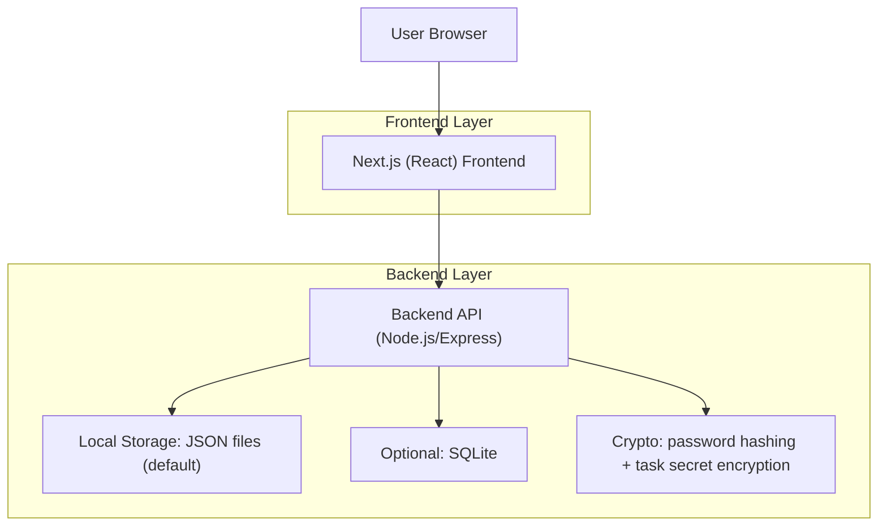

## 1. Architecture design


## 2. Technology Description
- Frontend: Next.js (React) + TypeScript + Tailwind CSS + existing UI component library in the repo (light theme as default)
- Backend: Node.js (Express) inside the same repo (local-only storage)
- Storage options:
  - Default: JSON files (simple, transparent, git-ignorable)
  - Optional: SQLite (single-file DB; still local and self-hosted)
- Auth:
  - Users stored locally with hashed passwords (Argon2 or bcrypt)
  - Sessions via httpOnly cookie + signed session id
- Task secrets:
  - Optional per-task secret field encrypted server-side (AES-256-GCM) before writing to storage

## 3. Route definitions (frontend)
| Route | Purpose |
|-------|---------|
| / | Tasks Dashboard (home): list/create/edit tasks, sign out |
| /auth | Sign in / sign up / forgot password entry point |
| /auth/reset | Reset password from email link |
| /account | Account & Security: change password |

## 4. API definitions (backend)
| Method | Route | Auth | Purpose |
|--------|-------|------|---------|
| POST | /api/auth/signup | No | Create account |
| POST | /api/auth/signin | No | Create session |
| POST | /api/auth/signout | Yes | Destroy session |
| POST | /api/auth/forgot | No | Create reset token (email sending optional; token returned for local dev) |
| POST | /api/auth/reset | No | Reset password using token |
| POST | /api/auth/change-password | Yes | Change password for signed-in user |
| GET | /api/me | Yes | Current user summary |
| GET | /api/tasks | Yes | List your tasks |
| POST | /api/tasks | Yes | Create task |
| PATCH | /api/tasks/:id | Yes | Update task |
| DELETE | /api/tasks/:id | Yes | Delete task |
| POST | /api/tasks/:id/reveal-secret | Yes | Decrypt and return a task secret on explicit action |

## 5. Local storage format

### 5.1 Users file (JSON)
`data/users.json`
```json
{
  "version": 1,
  "users": [
    {
      "id": "uuid",
      "email": "user@example.com",
      "passwordHash": "argon2id$...",
      "createdAt": "2026-01-20T12:00:00.000Z",
      "updatedAt": "2026-01-20T12:00:00.000Z"
    }
  ]
}
```

### 5.2 Tasks file (JSON)
`data/tasks.json`
```json
{
  "version": 1,
  "tasks": [
    {
      "id": "uuid",
      "userId": "uuid",
      "data": {
        "title": "Buy groceries",
        "notes": "Milk, eggs",
        "completed": false,
        "dueDate": "2026-01-25",
        "tags": ["home"],
        "secretCiphertext": "base64...",
        "secretIv": "base64...",
        "secretTag": "base64..."
      },
      "createdAt": "2026-01-20T12:00:00.000Z",
      "updatedAt": "2026-01-20T12:00:00.000Z"
    }
  ]
}
```

Notes:
- Each task belongs to exactly one user (`userId`).
- The server enforces access control: a user can only query/update tasks where `task.userId === session.userId`.
- If you use SQLite, keep the JSON task schema inside a `data` TEXT/JSON column.

## 6. Security model
- Passwords are never stored as plaintext; store only `passwordHash`.
- Reset tokens are one-time and expire (e.g. 30 minutes). Store only hashed tokens.
- Cookies are `httpOnly`, `sameSite=lax`, and `secure` in production.
- Secrets are encrypted server-side with a server-only key from env vars.
